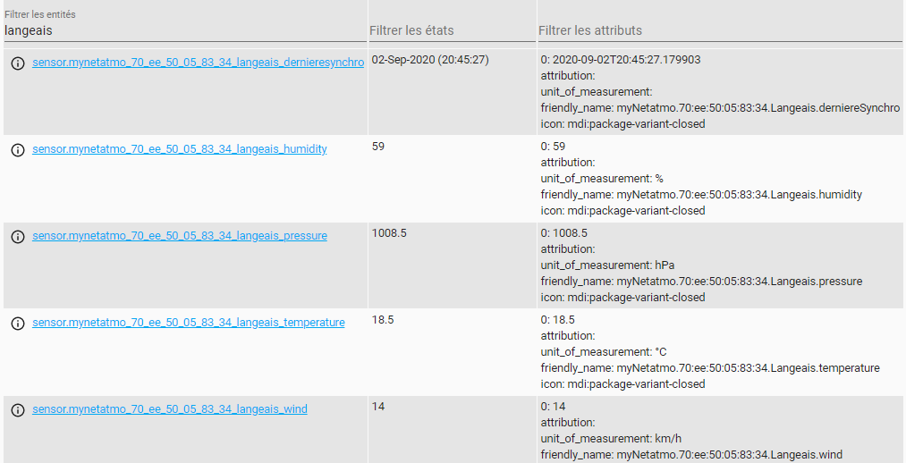

# apiNetatmo
apiNetatmo vous permet de recupere les informations des stations favorits de votre compte NetAtmo


il suffit d'ajouter le sensor suivant dans votre configuration home assistant


```yaml
- platform: apiNetatmo
  refreh_token : <votreRefreshToken>
  code: <votrecode>
  token: <votretoken>
  host: <une des adresse mac d'un de vos favori>
  scan_interval: 600
```
les elements sont a recupéré sur dev https://dev.netatmo.com/

Chaque favoris netatmo va creer les sensors selon le type de sensor netatmo( temperature, vent, humidite etc..


